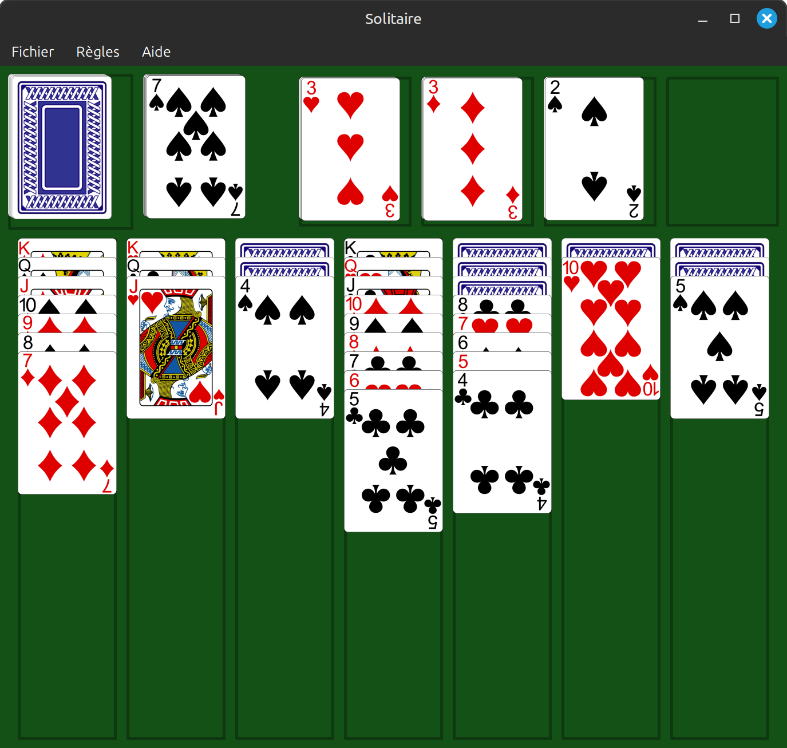
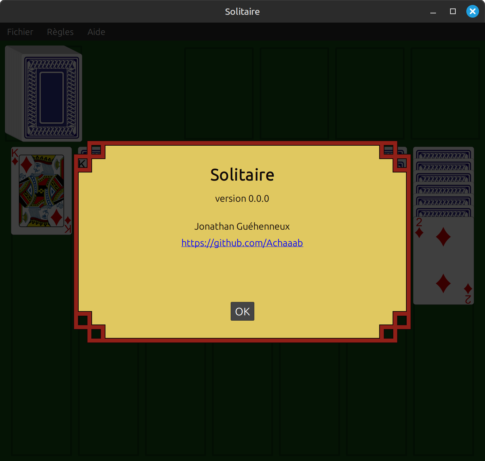

# Solitaire
[](https://www.gnu.org/licenses/gpl-3.0)

## Getting Started
These instructions will get you a copy of the project up and running on your local machine.
Remember that this project is still in the early stages of development.

### Prerequisites
* Java 17+
* Maven 3.8.1+
* Git 2.34.1+

### Installing and running
* Clone the repository from GitHub:
```shell
git clone https://github.com/Achaaab/solitaire.git
```
* Compile
```shell
cd solitaire
mvn package
```
* Run
```shell
java -jar target/solitaire-0.0.0.jar
```

## Screenshots



## Authors
* **Jonathan Guéhenneux** - *Programmer* - [Achaaab](https://github.com/Achaaab)

## License
This project is licensed under the GNU General Public License (GPL) - see the [LICENSE.md](LICENSE.md) for the details.

## Acknowledgments
* [AudioCue](https://github.com/philfrei/AudioCue-maven): [Phil Freihofner](https://adonax.com/)
* [Byron Knoll](https://byronknoll.blogspot.com/2011/03/vector-playing-cards.html)
